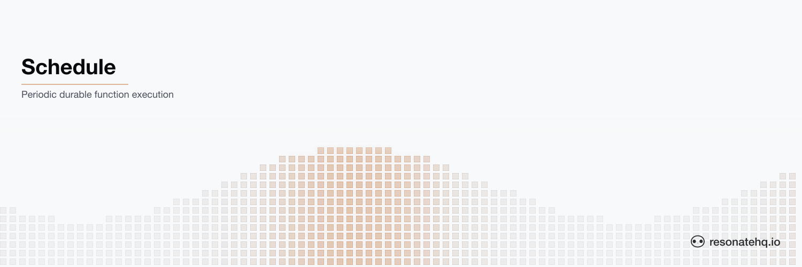

<picture>
  <source media="(prefers-color-scheme: dark)" srcset="./assets/banner-dark.png">
  <source media="(prefers-color-scheme: light)" srcset="./assets/banner-light.png">
  
</picture>

# Schedule

**Resonate Rust SDK**

Schedule a Rust function to run periodically using Resonate's high-level `schedule()` API.

Instructions on [How to run this example](#how-to-run-the-example) are below. The full pattern is documented at [docs.resonatehq.io/get-started/examples/schedule](https://docs.resonatehq.io/get-started/examples/schedule).

## What problem does this solve?

Running a function on a cron schedule sounds simple — but in practice, what happens when the worker crashes mid-execution? Traditional cron jobs offer no crash recovery: the job just doesn't run (or runs again from scratch on the next tick). Resonate makes scheduled executions durable. Each cron tick fires a new durable promise. If the worker crashes while processing it, Resonate retries automatically. No lost ticks, no manual recovery logic.

## Overview

This example shows how to use Resonate's `schedule()` method to register a function as a periodic job using a cron expression. The Resonate server triggers the function automatically, and a worker processes each execution durably.

```rust
// Register the function
resonate.register(generate_report).unwrap();

// Schedule it to run every minute
resonate
    .schedule(
        "daily_report",     // schedule ID
        "* * * * *",        // cron expression
        "generate_report",  // function name
        123_u64,            // arguments
    )
    .await?;
```

## How It Works

| File | Role |
|------|------|
| `src/bin/schedule.rs` | Creates the cron schedule on the Resonate server (run once) |
| `src/bin/worker.rs` | Registers the function and processes each tick (run continuously) |
| `src/lib.rs` | The function that runs on each scheduled tick |

The Resonate server fires a new durable promise on each cron tick. The worker picks it up, executes the function, and records the result. If the worker crashes, Resonate retries the execution automatically.

## Cron Reference

| Expression | Meaning |
|------------|---------|
| `* * * * *` | Every minute |
| `0 9 * * *` | Daily at 9am |
| `0 9 * * 1-5` | Weekdays at 9am |
| `*/30 * * * *` | Every 30 minutes |

## How to run the example

This example uses [Cargo](https://www.rust-lang.org/tools/install) as the build tool. After cloning, change directory into the project root.

This example application requires that a Resonate Server is running locally.

```shell
brew install resonatehq/tap/resonate
resonate dev
```

You will need 2 terminals to run this example, one to create the schedule and one for the Worker.

In _Terminal 1_, create the cron schedule on the Resonate server (run once):

```shell
cargo run --bin schedule
```

In _Terminal 2_, start the Worker to process each tick:

```shell
cargo run --bin worker
```

Every minute, you'll see output like:

```
[2026-04-25T09:00:00+00:00] Report for user 123
[2026-04-25T09:01:00+00:00] Report for user 123
```

## Learn more

- [Resonate Documentation](https://docs.resonatehq.io)
- [Schedule Pattern](https://docs.resonatehq.io/get-started/examples/schedule)
- [Schedules API](https://docs.resonatehq.io/learn/schedules)
- [Rust SDK Guide](https://docs.resonatehq.io/develop/rust)
